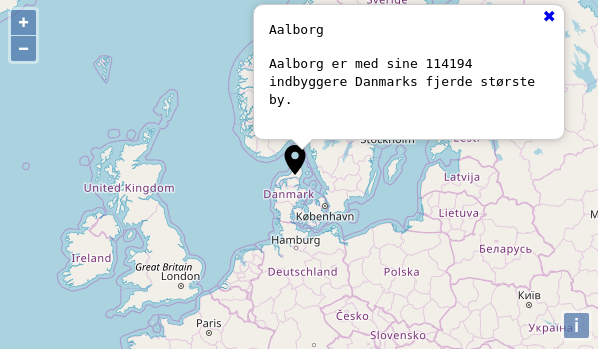

# Kort

Eksempel på et simpelt online kort med pin og tilhørende pop-up med forklaringstekst. Der tilbydes en nem måde at tilføje nye steder med tilhørende forklaring.

## Kom i gang

Du indstiller kortet i filen [/js/kort_indstillinger.js](js/kort_indstillinger.js). Som standard, er kortet sat op til at Odense, Danmark er centrum og med en enkelt pin med tilhørende forklaring i Aalborg, Danmark.

## Bidragsydere

Læs venligst [CONTRIBUTING.md](https://gist.github.com/PurpleBooth/b24679402957c63ec426) for detaljer om vores adfærdskodeks og processen til at indsende pull-anmodninger.

## Forfatter

* **Morten Bonderup** 

## Licens

Dette projekt er licenseret under BSD-licensen - se filen [LICENSE.md] (LICENSE.md) for detaljer

Baseret på https://openlayers.org/ under BSD license

Kort pin fra https://material.io/ under Apache License Version 2.0 (https://www.apache.org/licenses/LICENSE-2.0.html).
